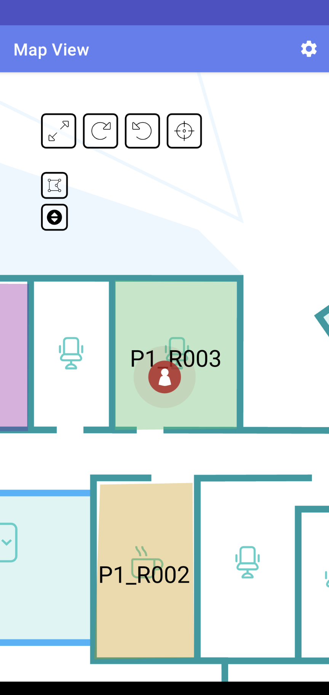
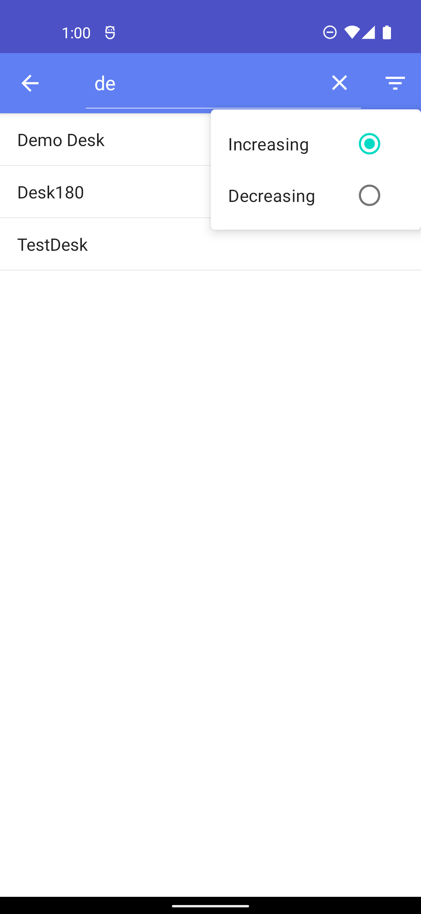

BlueGPS Android SDK - version 2
==


## 1. Introduction

This document holds a general guide for the integration of the BlueGPS SDK library into an Android
application. The BlueGPS SDK implements the communication with the BlueGPS server allowing Android
Applications to make use of the system.

> [!IMPORTANT]   
> All the data contained in this document are currently under development and may be subject to change.


## 2. Integration guide
### 2.1. Requirements

Minimum requirements are:

- Minimum SDK: 21
- Usage of Android X

### 2.2. Adding the Library to an existing Android application

Before you add BlueGPS depencencies, update your repositories in the `settings.gradle` file to include this repository

```gradle
dependencyResolutionManagement {
    repositoriesMode.set(RepositoriesMode.FAIL_ON_PROJECT_REPOS)
    repositories {
        google()
        mavenCentral()
        maven { url = uri("https://jitpack.io") }
    }
}
```

Or if you're using an older project setup, add this repository  in your project level `build.gradle` file:

```gradle
allprojects {
    repositories {
        google()
        mavenCentral()
        maven { url = uri("https://jitpack.io") }
    }
}
```

Then add the dependency for BlueGPS-SDK in the `build.gradle` file for your app or module:

```gradle
dependencies {
    implementation 'com.github.synapseslab:android-bluegps-sdk-public:<version>'
}
```

The `version` corresponds to release version, for example:

```gradle
dependencies {
    implementation 'com.github.synapseslab:android-bluegps-sdk-public:2.0.0'
}
```

## 3. Usage guide

### 3.1 Getting Started
Your first step is initializing the BlueGPSLib, which is the main entry point for all operations in the library. BlueGPSLib is a singleton: you'll create it once and re-use it across your application.

A best practice is to initialize BlueGPSLib in the Application class:

```kotlin
class App : Application() {
    override fun onCreate() {
        super.onCreate()
        
        BlueGPSLib.instance.initSDK(
            sdkEnvironment = Environment.sdkEnvironment,
            context = applicationContext,
            enabledNetworkLogs = true
        )
    }
}
```

> [!NOTE] 
> The BlueGSP-SDK use an `Environment` where integrator have to put SDK data for register the SDK and for create a communication with the BlueGPS Server. The management of the environment is demanded to the app.

```kotlin
object Environment {

    private val SDK_ENDPOINT = "{{provided-bluegps-endpoint}}"

    val keyCloakParameters = KeyCloakParameters(
        authorization_endpoint = "https://[BASE-URL]/realms/[REALMS]/protocol/openid-connect/auth",
        token_endpoint = "https://[BASE-URL]/realms/[REALMS]/protocol/openid-connect/token",
        redirect_uri = "{{HOST}}://{{SCHEME}}",
        clientId = "{{provided-client-secret}}", // for user authentication
        userinfo_endpoint = "https://[BASE-URL]/realms/[REALMS]/protocol/openid-connect/userinfo",
        end_session_endpoint = "https://[BASE-URL]/realms/[REALMS]/protocol/openid-connect/logout",
        guestClientSecret = "{{provided-guest-client-secret}}", // for guest authentication
        guestClientId = "{{provided-guest-client-id}}" // for guest authentication
    )

    val sdkEnvironment = SdkEnvironment(
        sdkEndpoint = SDK_ENDPOINT,
        keyCloakParameters = keyCloakParameters,
    )
}
```

### 3.2 App Authentication
The BlueGPS_SDK offers a client for managing authentication and authorization within your application. It leverages [Keycloak](https://www.keycloak.org/) to handle user authentication.

BlueGPS provides 2 kinds of authentication: 
    
- **User Authentication:**
    
If you want only the User authentication you must set the **`clientId`**. 

This means that for each device this is the user on Keycloak that can manage grants for this particular user. 

- **Guest Authentication:**

If you want only the Guest authentication, you must set the **`guestClientSecret`** and **`guestClientId`**. 

This means that we don't have a user that has to login but we use client credentials and there is not an individual user for each app install. Instead BlueGPS treats the user account as a "guest"
In this case multiple devices can use the same client credentials to be authenticated and BlueGPS will register the user as a device, and not as a formal Keycloak user.

> [!NOTE]
> This paramaters are provided by **Synapses** after the purchase of the **BlueGPS license**.

Finally in your `AndroidManifest.xml` add this and change `host` and `scheme` with your configuration.

```xml
<activity
    android:name="com.synapseslab.bluegps_sdk.authentication.presentation.AuthenticationActivity"
    android:exported="true">
    <intent-filter>
        <action android:name="android.intent.action.VIEW" />
        <category android:name="android.intent.category.DEFAULT" />
        <category android:name="android.intent.category.BROWSABLE" />

        <data
            android:host="{HOST}"
            android:scheme="{SCHEME}" />
    </intent-filter>
</activity>
```

Now your app is ready for use keycloak. See `KeycloakActivity.kt` example for an example of login, logout or refresh token.

### 3.3 Authentication status
Once the SDK is correctly setup, you can ask for authentication status, by using the following accessor facility:

```kotlin
BlueGPSAuthManager.instance.currentTokenPayload
```

`currentTokenPayload` expose the current token object (if any). You can also ask for validity as follow:

```kotlin
// check if access token is still valid
BlueGPSAuthManager.instance.currentTokenPayload.accessTokenValid

// check if refresh token is still valid
BlueGPSAuthManager.instance.currentTokenPayload.refreshTokenValid
```

For **obtain the current access token** use the following function:
```kotlin
BlueGPSAuthManager.instance.accessToken()
```

### 3.4 Guest login
For exec a guest login use the following function:

```kotlin
when (val result = BlueGPSAuthManager.instance.guestLogin()) {
    is Resource.Error -> {
        Log.e(TAG, result.message)
    }

    is Resource.Exception -> {
        Log.e(TAG, result.e.localizedMessage ?: "Exception")
    }

    is Resource.Success -> {
        Log.v(TAG, "Login in guest mode, ${result.data}")
        loginGuestMode.value = "Login in guest mode"

        // update access token on the environment
        Environment.sdkEnvironment.sdkToken = result.data.access_token
    }
}
```

### 3.5 Logout
For logout, there's a specific call that will clear all credentials both from your side and backend:

```kotlin
BlueGPSAuthManager.instance.logout(handleCallback = {
    if (it) {
        Log.d(TAG, "SUCCESS logged out")
    } else {
        Log.e(TAG, "ERROR logged out")
    }
})
```

## 4. Use BlueGPS Advertising Service
For use the BlueGPS Advertising service, defines callbacks for service binding, passed to `bindService()`

```kotlin
private val advertisingServiceConnection = object : ServiceConnection {

    override fun onServiceConnected(name: ComponentName, service: IBinder) {
        val binder = service as BlueGPSAdvertisingService.LocalBinder
        blueGPSAdvertisingService = binder.serviceBlueGPS
    }

    override fun onServiceDisconnected(name: ComponentName) {
        blueGPSAdvertisingService = null
    }
}
```

Bind to BlueGPSAdvertisingService `onStart()` function:

```kotlin
override fun onStart() {
    super.onStart()

    val serviceIntent = Intent(this, BlueGPSAdvertisingService::class.java)
    bindService(
        serviceIntent,
        advertisingServiceConnection,
        Context.BIND_AUTO_CREATE
    )
}
```

Clients should unbind from services at appropriate times

```kotlin
override fun onStop() {
    super.onStop()
    unbindService(advertisingServiceConnection)
}
```

For **start the advertising** call:

```kotlin
blueGPSAdvertisingService?.startAdv()
```

or 

```kotlin
blueGPSAdvertisingService?.startAdv(androidAdvConfiguration = androidAdvConfiguration!!)
```

where `androidAdvConfiguration` a device configuration for advertising as follow:

```kotlin
data class AndroidAdvConfiguration(
    var tagid: String? = null,
    var advModes: String? = null,
    var advTxPowers: String? = null
)
```

For **stop your service advertising** call:

```kotlin
blueGPSAdvertisingService?.stopAdv()
```

### 4.1 Get device configuration
For obtain a device configuration for advertising call this function:

```kotlin
suspend fun getOrCreateConfiguration(): Resource<AndroidAdvConfiguration>
```

if you want to submit a specific tag to be bound to your app you can use the following:

```kotlin
suspend fun getOrCreateConfiguration(tagId: "012345678912"): Resource<AndroidAdvConfiguration>
```

### 4.2. Optional
If you are interested to receiver logs and display info about the status of the Service,
subclass ``BroadcastReceiver`` and implement the ``onReceive(...)`` method.

The status of the service are: ``STARTED``, ``STOPPED``, ``ERROR``.

```kotlin
private val advertisingServiceReceiver = object : BroadcastReceiver() {
        override fun onReceive(context: Context, intent: Intent) {
            if (intent.action == BlueGPSAdvertisingService.ACTION_ADV) {
                intent.getParcelableExtra<AdvertisingStatus>(BlueGPSAdvertisingService.DATA_ADV)?.let {

                    Log.d(TAG, "- Service ${it.status} ${it.message}")
                }
            }
        }
    }
```

then register the receiver in ``onResume()`` method and unregister the receiver in ``onPause()``
method.

Show the demo example for more details.


## 5 BlueGPSMapView

BlueGPS comes with an handy object to deal with Maps named `BlueGPSMapview`. To use the object you
can import the component in your xml layout or programmatically inflate it.

#### Android View

```xml
<com.synapseslab.bluegps_sdk.component.map.BlueGPSMapView 
    android:id="@+id/webView"
    android:layout_width="match_parent" 
    android:layout_height="match_parent"
    app:layout_constraintBottom_toBottomOf="parent" 
    app:layout_constraintEnd_toEndOf="parent"
    app:layout_constraintStart_toStartOf="parent" 
    app:layout_constraintTop_toTopOf="parent" />
```

Before can be used, `BlueGPSMapView` should be initialized. Otherwise you will see a loading
animation like below:


In order to configure properly the object you need call the `initMap()`

```kotlin
fun initMap(
    sdkEnvironment: SdkEnvironment,
    configurationMap: ConfigurationMap? = ConfigurationMap()
) { 
    ....
}
````

with this parameters:

1. `sdkEnvironment` for authenticate the map;
2. `configurationMap` to config your map, the map start with a default configuration;

```kotlin
private var configurationMap = ConfigurationMap(
    tagid = "CFFF00000001",
    style = MapStyle(
        icons = IconStyle(
            name = "chorus",
            align = "center",
            vAlign = "bottom",
            followZoom = true
        ),
        
        navigation = NavigationStyle(
            iconSource = "/api/public/resource/icons/commons/start.svg",
            iconDestination = "/api/public/resource/icons/commons/end.svg",
            
            // dictionary of target velocity calculation, the velocity is expressed in km/h
            velocityOptions = mutableMapOf("foot" to 4.0, "bike" to 10.0),
            
            // unit in meters to divide the navigation in steps
            navigationStep = 1.5,
            
            // enable or disable autoZoom capability when in navigation mode
            autoZoom = true,
            
            // debug capability to see the steps when in navigation mode
            showVoronoy = false
        )
    ),
    show = ShowMap(all = true, room = true),
)
```

At this point the configuration is injected and the loading animation should disappear and replaced
by your map:



#### Jetpack Compose

```kotlin
AndroidView(
    modifier = Modifier
        .fillMaxSize(),
    factory = { it ->
        BlueGPSMapView(it).apply {
            layoutParams = ViewGroup.LayoutParams(
                ViewGroup.LayoutParams.MATCH_PARENT,
                ViewGroup.LayoutParams.MATCH_PARENT
            )

            initMap(Environment.sdkEnvironment, configurationMap)

            // View -> Compose communication
            setBlueGPSMapListener(object : BlueGPSMapListener {
                override fun resolvePromise(
                    data: JavascriptCallback,
                    typeMapCallback: TypeMapCallback
                ) {
                    when (typeMapCallback) {
                        TypeMapCallback.INIT_SDK_COMPLETED -> {
                        }

                        TypeMapCallback.RESOURCE_CLICK -> {
                        }

                        TypeMapCallback.FLOOR_CHANGE -> {
                        }

                        TypeMapCallback.SUCCESS -> {
                        }

                        TypeMapCallback.ERROR -> {
                        }

                        else -> {}
                    }
                }
            })
        }
    }, update = {
        // Compose -> View communication
        
    }
)
```

### 5.1 Map Listener

BlueGPSMapView could trigger your app remotely from the server. To handle an event click on the map,
it's necessary setup the listener.

```kotlin
private fun setListenerOnMapView() {
    binding.webView.setBlueGPSMapListener(object : BlueGPSMapListener {
        override fun resolvePromise(data: JavascriptCallback, typeMapCallback: TypeMapCallback) {
            /**
                * Callback that intercept the click on the map
                *
                * @param data the clicked point with all info.
                * @param typeMapCallback the type of the clicked point.
                *
                */
                when (typeMapCallback) {
                    
                    TypeMapCallback.INIT_SDK_COMPLETED -> { }   
                    TypeMapCallback.PARK_CONF -> { }
                    TypeMapCallback.MAP_CLICK, TypeMapCallback.TAG_CLICK -> { 
                        val cType = object : TypeToken<Position>() {}.type
                        val payloadResponse = Gson().fromJson<Position>(data.payload, cType)
                        
                        if (payloadResponse.roomId != null) {
                            // is a room
                        } else if (payloadResponse.tagid != null) {
                            // is a tag
                        }
                    }
                    TypeMapCallback.BOOKING_CLICK -> {
                        val cType = object : TypeToken<ClickedObject>() {}.type
                        val payloadResponse = Gson().fromJson<ClickedObject>(data.payload, cType)
                        Log.d(TAG, " $TAG $payloadResponse ") 
                    }
                    TypeMapCallback.NAV_STATS -> {
                        val cType = object : TypeToken<NavigationStats>() {}.type
                        val payloadResponse = Gson().fromJson<NavigationStats>(data.payload, cType)
                        Log.d(TAG, " $TAG $payloadResponse ")
                    }
                    TypeMapCallback.NAV_INFO -> {
                        val cType = object : TypeToken<NavInfo>() {}.type
                        val payloadResponse = Gson().fromJson<NavInfo>(data.payload, cType)
                        Toast.makeText(context, "${payloadResponse.message}", Toast.LENGTH_LONG).show()
                    }
                    TypeMapCallback.RESORUCE -> {
                        val cType = object : TypeToken<DataFilter>() {}.type
                        val payloadResponse = Gson().fromJson<DataFilter>(data.payload, cType)
                        Log.d(TAG, " $TAG $payloadResponse ")
                    }
                    TypeMapCallback.TAG_VISIBILITY -> {
                        val cType = object : TypeToken<TagVisibility>() {}.type
                        val payloadResponse = Gson().fromJson<TagVisibility>(data.payload, cType)
                        Log.d(TAG, " $TAG $payloadResponse ")
                    }
                    TypeMapCallback.ROOM_ENTER -> {
                        val cType = object : TypeToken<Position>() {}.type
                        val payloadResponse = Gson().fromJson<Position>(data.payload, cType)
                        Log.d(TAG, " $TAG $payloadResponse ")
                    }
                    TypeMapCallback.ROOM_EXIT -> {
                        val cType = object : TypeToken<Position>() {}.type
                        val payloadResponse = Gson().fromJson<Position>(data.payload, cType)
                        Log.d(TAG, " $TAG $payloadResponse ")
                    }
                    TypeMapCallback.FLOOR_CHANGE -> {
                        val cType = object : TypeToken<Floor>() {}.type
                        val payloadResponse = Gson().fromJson<Floor>(data.payload, cType)
                        Log.d(TAG, " $TAG $payloadResponse ")
                    }
                    TypeMapCallback.SUCCESS -> {
                        val cType = object : TypeToken<GenericInfo>() {}.type
                        val payloadResponse = Gson().fromJson<GenericInfo>(data.payload, cType)
                        payloadResponse.key = data.key
                        Log.d(TAG, " ${payloadResponse.message} ")
                    }
                    TypeMapCallback.ERROR -> {
                        val cType = object : TypeToken<GenericInfo>() {}.type
                        val payloadResponse = Gson().fromJson<GenericInfo>(data.payload, cType)
                        payloadResponse.key = data.key
                        Log.e(TAG, " ${payloadResponse.message} ")
                    }
            }
        }
    })
}
```

Once implemented, you can easily test receiving remote events by tapping on a room, or a tag in your
app.

The `resolvePromise(::)` method should be triggered appropriately.

List of the callbacks:

- `TypeMapCallback.INIT_SDK_COMPLETED` triggered when init sdk is completed.
- `TypeMapCallback.PARK_CONF` triggered if show.park is enabled.
- `TypeMapCallback.BOOKING_CLICK` triggered if a bookable resource is clicked.
- `TypeMapCallback.NAV_STATS` triggered on any navigation update.
- `TypeMapCallback.NAV_INFO` triggered on navigation mode when tag is proximity to specific. points. 
- `TypeMapCallback.RESORUCE` triggered when loadGenericResource is called.
- `TypeMapCallback.TAG_VISIBILITY` triggered if ConfigurationMap.tagid is present and the tag change its visibility status.
- `TypeMapCallback.ROOM_ENTER` triggered when user enter a room.
- `TypeMapCallback.ROOM_EXIT` triggered when user exit a room.
- `TypeMapCallback.FLOOR_CHANGE` triggered when the user change floor.
- `TypeMapCallback.RESOURCE_CLICK` triggered when the user click on resource on map.
- `TypeMapCallback.PATH_RECALCULATION` triggered when the map recalculate the path.
- `TypeMapCallback.AUTH_ERROR` triggered when access token is expired and its necessary to update the map calling `initAuth()`.
- `TypeMapCallback.SUCCESS` triggered when a generic async action end with success.
- `TypeMapCallback.ERROR` triggered when a generic async action end with error.

## 5.2 Map Interactions

BlueGPSMapView support multiple interactions that could be triggered programmatically from the code.

### 5.2.1 resetView

```kotlin
mapView.resetView()
```

This action resize the map to the startup. The action is present on the map toolbox.

### 5.2.2 rotate

```kotlin
mapView.rotate(step: Int)
```

This action rotate the map by adding step to current location. `step` represent the incremental
number of degree to rotate the map.

### 5.2.3 rotateAbsolute

```kotlin
mapView.rotateAbsolute(angle: Int)
```

his action set the angle rotation of the map according to the parameter. `angle` represent the
absolute number of degree to rotate the map.

### 5.2.4 hideRoomLayer

```kotlin
mapView.hideRoomLayer(hide: Boolean)
```

This action allow to show or hide the room layer. `hide` if true hide the layer, false otherwise.

### 5.2.5 nextFloor

```kotlin
mapView.nextFloor()
```

This action allow to load the next floor on the web view.

### 5.2.6 showTag

```kotlin
mapView.showTag(tagid: String, follow: Boolean)
```

This action find the tag with the specified tagid and if found switch to the right floor and follow the tag if `follow` is true.

### 5.2.7 getFloor

```kotlin
mapView.getFloor() { result, error ->
    error?.let {
        Log.e(TAG, "$error")
    } ?: run {
        MaterialAlertDialogBuilder(this@MapActivity)
            .setTitle("Floor list")
            .setMessage(result.toString())
            .setPositiveButton("Ok") { dialog, _ ->
                dialog.dismiss()
            }
            .show()
    }
}
```

Return the list of floors, in the form of [Floor].

### 5.2.8 gotoFloor

```kotlin
mapView.gotoFloor(floor: Floor)
```

Move the map to the specified Floor.

### 5.2.9 gotoFromMe

```kotlin
mapView.gotoFromMe(
    position: Position, 
    navigationMode: Boolean = false)
```

This function enable path drawing for a specific destination. The path drawing will from the user position to the selected destination position.

`navigationMode`: if true, draw the path in navigation mode.

### 5.2.10 goto

```kotlin
mapView.goto(
    source: Position, 
    dest: Position, 
    navigationMode: Boolean = false)
```

This function enable path drawing for a specific destination. The path drawing will from the source position to the selected destination position.

`navigationMode`: if true, draw the path in navigation mode.

### 5.2.11 getMapStyle

```kotlin
mapView.getMapStyle() {result, error ->
    error?.let {
        Log.e(TAG, "$error")
    } ?: run {
        Log.d(TAG, "$result")
    }
}
```

This function get the actual style configuration.

### 5.2.12 setMapStyle

```kotlin
mapView.setMapStyle(style: MapStyle)
```

`style`: represent the map style object

This function allow to change the map style, the function overwrite only the attribute present.

### 5.2.13 setStartBookingDate

```kotlin
mapView.setStartBookingDate(date: String? = today)
```

`date`: BASIC_ISO string in format yyyy-MM-dd (ex. 2021-08-30), if not present dafault is today.

This function allow to set the start of booking selection, by default is today.

### 5.2.14 setBookingDate

```kotlin
mapView.setBookingDate(date: String)
```

`date`: BASIC_ISO string in format yyyy-MM-dd (ex. 2021-08-30).

This function allow to set the booking selection.

### 5.2.15 reloadResource

```kotlin
mapView.reloadResource(date: String)
```

`date`: BASIC_ISO string in format yyyy-MM-dd (ex. 2021-08-30).

This function reload the map view.

### 5.2.16 removeNavigation

```kotlin
mapView.removeNavigation()
```

This function exit from navigation and remove path either on navigation mode or not.

### 5.2.17 loadGenericResource

```kotlin
mapView.loadGenericResource(search: String? = "", type: String? = "", sybtype: String? = "")
```

- `search`: the resource name
- `type`: of the resource
- `subtype` of the resource

This function load only resource that match the criteria passed by parameters.

### 5.2.18 selectPoi

```kotlin
mapView.selectPoi(poi: GenericResource, changeFloor: Boolean? = true)
```

- `poi`: generic resource
- `changeFloor`: optional parameter with default value to true

Center the map to the poi passed as parameter.

### 5.2.19 selectPoiById

```kotlin
mapView.selectPoiById(poiId: Int, changeFloor: Boolean? = true)
```

- `poiId`: id of the poi
- `changeFloor`: optional parameter with default value to true

Center the map to the poi identified by poiId.

### 5.2.20 drawPin

```kotlin
mapView.drawPin(position: Position, icon: String? = "")
```

- `position`: object position
- `icon`: a String the represent absolute or relative path to the icon.

Draw a pin in the passed position. The pin has the icon passed as parameter.

### 5.2.21 getCurrentFloor

```kotlin
mapView.getCurrentFloor()
```

Return the current floor on the map.

### 5.2.22 centerToRoom

```kotlin
mapView.centerToRoom(roomId: Int)
```

`roomId` the id of the room

Center the map to the room identified by roomId.

### 5.2.23 centerToPosition

```kotlin
mapView.centerToPosition(mapPosition: Position, zoom: Double)
```

- `mapPosition` the object position
- `zoom` the zoom level. The range is a double [0.7, 10]

Center the map to the specified position with defined zoom level.

### 5.2.24 initAllBookingLayerBy

```kotlin
mapView.initAllBookingLayerBy(bookFilter: BookFilter)
```

- `bookFilter` a book filter

Init on map all booking layer like: Desk, Park, Meeting.

### 5.2.25 setDarkMode

```kotlin
mapView.setDarkMode(darkMode: Boolean)
```

- `darkMode` a boolean

To change the style of the map darkMode or lightMode

### 5.2.26 showResourceOnMap

```kotlin
mapView.showResourceOnMap(
    resources: List<Resource>? = emptyList(), 
    autoFloor: Boolean = true
)
```

- `resources` a list of [Resource]
- `autofloor` If autofloor is enabled the map floor is changed according to resources visibility.

Show the provided resources list on map.

### 5.2.27 clearSelection

```kotlin
mapView.clearSelection()
```

Clear the selection of resources on map.

### 5.2.28 activatePositionMarker

```kotlin
mapView.activatePositionMarker(enable: Boolean)
```

- `enable` a booelan true to activate, false to deactivate

Activate/Deactivate Position marker layer.

### 5.2.29 clearPositionMarker

```kotlin
mapView.clearPositionMarker()
```

Clear and remove position marker.

### 5.2.30 getPositionMarker

```kotlin
mapView.getPositionMarker(
    completionHandler: (Position?, Error?) -> Any?
)
```

- `completionHandler` return the position marker with format {mapId: 4, x: 23.87, y: 10.49}

Retrieve position marker.

### 5.2.31 forceFollowMe

```kotlin
mapView.forceFollowMe(force: Boolean)
```

- `force` if true automatically follow and center map on tag, false otherwise.

### 5.2.32 resetPath

```kotlin
mapView.resetPath()
```

Clear the draw path on the map.

### 5.2.33 resetDataAndTag

```kotlin
mapView.resetDataAndTag()
```

Clear all the data and the tag draw on the map.

### 5.2.34 resetAll

```kotlin
mapView.resetAll()
```

Clear all elements draw on the map.

### 5.2.35 setTag

```kotlin
mapView.setTag(tagId: String, follow: Boolean = true)
```

- `tagId` the tagId to draw on map
- `follow` if true follow the tagId, otherwise only draw the tagId

Draw the tagId on the map and follow it if true, otherwise only draw the tagId.


<div style="page-break-after: always;"></div>


## 6. Server Sent Events

The purpose of diagnostic API is to give an indication to the integrator of the status of the
BlueGPS system.

The diagnostic is designed to include different info like:

- Tag tracking status
- Connector tracking status like:
    - DesigoCC
    - Micronpass
    - Quuppa

### 6.1 Diagnostic SSE

For diagnostic if a tag is `ACTIVE` or `NOT_ACTIVE`, `BlueGPSLib` expose a specific call `startDiagnostic(..)` where:

- `diagnosticSseRequest` is a list of tags; 
- `onComplete` callback; 
- and optional `onTagTracking`, `onCheck` and `onStop`  callbacks.

```kotlin
val diagnosticSseRequest = DiagnosticSseRequest(
    TrackingSseRequest(tags = listOf("BBBB00000001", "BBBB00000002"))
)

BlueGPSLib.instance.startDiagnostic(
    diagnosticSseRequest = diagnosticSseRequest,
    onComplete = {
        // is a DiagnosticSseResponse
        Log.d(TAG, "COMPLETE: $it")
    },
    onTagTracking = {
        // is a Map<String, DiagnosticStatus>?
        Log.d(TAG, "TAG_TRACKING: $it")
    },
    onCheck = {
        // is a String
        Log.d(TAG, "CHECK: $it")
    },
    onStop = {
        Log.d(TAG, "STOPPED: $it")
    }
)
``` 

`diagnosticSseRequest` is an object so structured:

```kotlin
class DiagnosticSseRequest(
    val tagTracking: TrackingSseRequest? = null
)

class TrackingSseRequest(
    val forgetTagMillis: Long? = 10000,
    val tags: List<String>? = null,
)
```

where

- `forgetTagMillis` is default to 10 seconds;
- `tags` is a list of tags you want to monitoring.

There are 2 types of events:

### Event `complete`

This event is returned as the first event and `DiagnosticSseResponse` object has the following format:

```
    data: {"tracking":{"tags":{"BBBB00000001":"NOT_ACTIVE"}}}
    name: "complete"
```

### Event `tagTracking`

This event is returned when there is an update on list of tags:

```
    data: {"BBBB00000001":"ACTIVE"}
    name: "tagTracking"
```

The `data` response is a `Map<String, DiagnosticStatus>`.

### Event `onCheck`

This event is a check that notifies that the diagnostic is alive.

### stopDiagnostic

`BlueGPSLib` expose an accessory method for deactivate the diagnostic.

```kotlin
BlueGPSLib.instance.stopDiagnostic()
```

> If during the life of the app it's necessary change the configuration it will be enough to call `startDiagnostic(..)`
because this method stop a previously job active and start the diagnostic with the new configuration. 

For more info check the example app in `SseDiagnosticTagActivity.kt` class.

### 6.2 Notify region changes

For activate the position event detection when the user move inside building,
`BlueGPSLib` expose a specific call `startNotifyRegionChanges(..)` where the params of this function are:

- `tags` a list of tags to monitoring;
- `regions` represents the list of the regions to monitor;
- `callbackHandler` callback that return a map that contains the regions where the tags are currently located;
- `onStop` event the SDK automatically stop the job and notify to the user.

```kotlin
BlueGPSLib.instance.startNotifyRegionChanges(
    tags = listOf(element = "010001010007"),
    regions = regions,
    callbackHandler = { it: Map<String, MutableList<BGPRegion>> ->
        
    },
    onStop = {

    }
)
```

#### 6.2.1 Event `callbackHandler`

This callback return a value when an event occurred. The object `BGPRegion` has this structure:

```kotlin
data class BGPRegion(
    val id: Int? = null,
    val name: String? = null,
    val buildingFloorId: Int? = null,
    val buildingFloorName: String? = null,
    val px: Double? = null,
    val py: Double? = null,
    val showOnApp: Boolean? = null,
    val searchable: Boolean? = null,
    val status: BGPRegionStatus? = null,
    val type: String? = null,
    val areaId: Int? = null,
    val areaName: String? = null,
    val area: BGPArea? = null,
    var isInside: Boolean = false,
)
```

> [!IMPORTANT]
> Before call `startNotifyRegionChanges()` it's necessary to call `blueGPSAdvertisingService?.startAdv() or `blueGPSAdvertisingService?.startAdv(androidAdvConfiguration = androidAdvConfiguration!!)`because when advertising service is started a `tagID` is assigned to the app.


#### 6.2.2 Stop notify region changes

`BlueGPSLib` expose an accessory method for deactivate the Notify region job.

```kotlin
BlueGPSLib.instance.stopNotifyRegionChanges()
```

> [!NOTE]
> If during the life of the app it's necessary change the configuration it will be enough to re-call `startNotifyRegionChanges(..)` because this method stop a previously job active and start the event detection with the new configuration.

For more info check the example app in `NotifyRegionActivity.kt` class.


### 6.3 Notify position changes

For activate the position event detection when the user move inside building,
`BlueGPSLib` expose a specific call `startNotifyPositionChanges()` where the params of this function are:

- `callbackHandler` callback;
- `onStopEvent` event the SDK automatically stop the job and notify to the user

```kotlin
BlueGPSLib.instance.startNotifyPositionChanges(
    callbackHandler = {
        Log.d(TAG, "$position ${it}")
    },
    onStopEvent = {

    }
)
```

#### 6.3.1 Event `callbackHandler`

This callback return a value when an event occurred. The object returned `Position` has this structure:

```kotlin
data class Position(
    var mapId: Int? = null,
    var tagid: String? = null,
    var roomId: Int? = null,
    var areaId: Int? = null,
    var x: Double? = null,
    var y: Double? = null,
    var data: String? = null,
    var tagLabel: String? = null,
)
```

#### 6.3.2 Stop notify position changes

`BlueGPSLib` expose an accessory method for deactivate the Notify position job.

```kotlin
BlueGPSLib.instance.stopNotifyPositionChanges()
```

> [!NOTE]
> If during the life of the app it's necessary change the configuration it will be enough to re-call `startNotifyPositionChanges(..)` because this method stop a previously job active and start the event detection with the new configuration.

For more info check the example app in `NotifyPositionActivity.kt` class.

<div style="page-break-after: always;"></div>

### 6.4 Notify generic events

For activate the generic event detection,
`BlueGPSLib` expose a specific call `startNotifyEventChanges()` where the params of this function are:

- `streamType` type of the stream.
- `outputEvents` List of events to be notified for the specific types of stream.
- `tagIdList` List of tag id to monitoring. If empty receive notification for all tags.
- `callbackHandler` returns a generic event.
- `onStop` callback when the connection with the server is closed.

```kotlin
BlueGPSLib.instance.startNotifyEventChanges(
    streamType = StreamType.TAGID_EVENT,
    outputEvents = listOf("test"),
    tagIdList = listOf("DADA00000001",),
    callbackHandler = {

    },
    onStop = {

    }
)
```

#### 6.4.1 Event `callbackHandler`

This callback return a value when an event occurred. The object returned `Event` has this structure:

```kotlin
data class Event(
    val id: String? = null, 
    val name: String? = null, 
    val data: String? = null
)
```

#### 6.4.2 Stop notify event changes

`BlueGPSLib` expose an accessory method for deactivate the Notify generic job.

```kotlin
BlueGPSLib.instance.stopNotifyEventChanges()
```

> [!NOTE]
> If during the life of the app it's necessary change the configuration it will be enough to re-call `startNotifyEventChanges(..)` because this method stop a previously job active and start the event detection with the new configuration.

For more info check the example app in `NotifyPositionActivity.kt` class.

<div style="page-break-after: always;"></div>

## 7 Resources API

The BlueGPSLib perform a network call to find a list of resources. 

```kotlin
    override suspend fun findResources(
        isDesc: Boolean?,
        mapId: Int?,
        order: String?,
        search: String?,
        subType: String?,
        type: String?,
        roomId: Int?,
        roomName: String?
    ): Resource<List<GenericResource>?>
```

where

- `isDesc` a boolean that represent if is increasing or decreasing
- `mapId` the id of the map where the resource is located
- `order` 
- `search` the name of the resource
- `subType`
- `type` the resource type (`PARK`, `DESK`, `MEETING`)
- `roomId` the id of the room where the resource is located
- `roomName` the name of the room where the resource is located

It's present an example activity called `ShowResourcesActivity.kt` that show the utility and the use of this network call.



<div style="page-break-after: always;"></div>

## 8 Search object API

BlueGPSSDK provides some built-in capabilities to search for resources and objects within the Backend, providing multiple calls:

### 8.1 getTrackElement

**getTrackElement** returns a tracked element by passing a corresponding **ID**.

```kotlin
suspend fun getTrackElement(trackElementId)
```

The resulting **ResponseMessage** contains a `TrackedElement` as follow:

```kotlin
data class TrackedElement(
    var id: Int?,
    var label: String?,
    var type: String?,
    var description: String?,
    var imgPath: String?,
    var color: String?,
    var trackElementType: TrackElementType?,
    var groups: List<TrackedGroup>?,
    var trackAreaId: Int?,
    var positionItem: PositionItem?,
    var tagList: List<TrackElementTag>?,
)
```

### 8.2 getTrackElementTagHistory

**getTrackElementTagHistory** returns a tag history passing a corresponding **ID**.

```kotlin
suspend fun getTrackElementTagHistory(trackElementId: Int)
```

The resulting **ResponseMessage** contains a list of `List<TrackElementTag>` as follow:

```kotlin
data class TrackElementTag(
    var id: Int?,
    var insertDate: String?,
    var readOnly: Boolean = true,
    var end: String?,
    var start: String?,
    var priority: Int?,
    var trackElementId: Int?,
    var trackElementLabel: String?,
    var trackTagId: String?,
    var trackTagLabel: String?,
)
```

### 8.3 getTrackElements

**getTrackElements** return an array of `TrackElement` based on the filter criteria specified.

```kotlin
suspend fun getTrackElements(
    type: String? = null,
    groupIds: List<Int>? = null,
    search: String? = null,
    isDesc: Boolean? = null,
    order: String? = null,
)
```

where:

- `search` is the name of the track element
- `type` 
- `groupIds` a list of id that represent the group
- `isDesc` a boolean that represent if is increasing or decreasing
- `order` a string that represent the order by a attribute
- `pageNumber` an that represent the current page
- `pageSize` the elements of the page

The resulting **ResponseMessage** contains a `List<TrackElement>` as follow:

```kotlin
data class TrackElement(
    var id: Int? = null,
    var label: String? = null,
    var type: String? = null,
    var description: String? = null,
    var imgPath: String? = null,
    var email: String? = null,
    var color: String? = null,
    var trackElementType: TrackElementType? = null,
    var groups: List<TrackedGroup>? = null,
    var positionItem: PositionItem? = null
)
```


### 8.4 getTrackElementPage

**getTrackElementPage** return a track element page based on the filter criteria specified.

```kotlin
suspend fun getTrackElementPage(
    type: String? = null,
    groupIds: List<Int>? = null,
    search: String? = null,
    isDesc: Boolean? = null,
    order: String? = null,
)
```

where:

- `search` is the name of the track element
- `type` 
- `groupIds` a list of id that represent the group
- `isDesc` a boolean that represent if is increasing or decreasing
- `order` a string that represent the order by a attribute

The resulting **ResponseMessage** contains a `PageTrackedElement` as follow:

```kotlin
class PageTrackedElement(
    var content: List<TrackedElement>,
    var numberOfElements: Int?,
    var first: Boolean,
    var last: Boolean,
    var totalElements: Int?,
    var totalPages: Int?,
)
```


### 8.5. getTrackGroup

**getTrackGroup** return a list of track group based on the filter criteria specified.

```kotlin
suspend fun getTrackGroup()
```

The resulting **ResponseMessage** contains a list of `List<TrackedGroup>` as follow:

```kotlin
data class TrackedGroup(
    var id: Int? = null,
    var label: String? = null,
    var type: String? = null,
    var color: String? = null,
)
```


### 8.6 getSearchableTrackTag

Get a searchable track tag list filtering also by NFC code

```kotlin
suspend fun getSearchableTrackTag(
    search: String? = null,
    tagId: String? = null,
    label: String? = null,
    nfcCode: String? = null,
) : Resource<List<TrackTag>>
```

where:

- `search` specifying this query param the search is performed on the label, tagid and nfcCode attributes.
- `tagId` specifying this parameter will return a list of tags that have exactly the specified tagid.
- `label` specifying this parameter will return a list of tags that have exactly the specified label.
- `nfcCode` specifying this parameter will return a list of tags that have exactly the specified nfcCode.

The resulting **ResponseMessage** contains a list of `List<TrackTag>` as follow:

```kotlin
data class TrackTag(
    var tagid: String? = null,
    var label: String? = null,
    var color: String? = null,
    var nfcCode: String? = null,
    var type: String? = null
)
```

<div style="page-break-after: always;"></div>

## 9 Controllable items API

BlueGPSSDK provides a logic to interact with controllable items exposed by the backend.

Controllable items could be anything that can be remote controlled by the application.

Authenticated user could get the list of available items with the following call:

```kotlin
suspend fun BlueGPSLib.getControllableItems(itemControllableFilter: ItemControllableFilter? = null)
```

You can pass an optional filter criteria as follow:

```kotlin
data class ItemControllableFilter(
    ///full search on Item.logicName
    var logicName: String? = null,
    ///Search the item into a specified area
    var areaId: Int? = null,
    ///Search the item connected to a specified room
    var roomId: Int? = null,
    ///Search the item connected to a specified map
    var mapId: Int? = null,
    //Filter the item inside reference point from the radius
    var referencePoint: Position? = null,
    //Must be combined with referencePoint
    var radius: Double? = null,
    ///Select items of following types
    var types: List<ControllableElementType>? = null,
    var hasPosition: Boolean? = null,
    var widgetNames: List<String>? = null
)
```

The resulting `ResponseMesssage` contains a list of `List<ItemControllable>` as follow:

```kotlin
data class ItemControllable(
    var id: String,

    ///Internal name of the item
    var logicName: String,

    ///Internal name of the widget connected to the item
    var widgetName: String,

    ///name of this item
    var name: String?,

    ///internationalization key of this item
    var i18nName: String?,

    ///type of the current item
    var type: ControllableElementType,

    var position: Position?,

    var buildingPositionList: List<BuildingPosition>?,

    var icon: MobileIcon?,

    var controls: List<ItemControl>?
)
```

The attribute `controls` contains all the available controllable items for this specific `ItemControllable`.

Every `ItemControl`, could be changed, by modifying its `currentValue` property.

Then, you can call the below function to save new current value.

```kotlin
suspend fun BlueGPSLib.setControllableItem(itemCurrentValue: ItemCurrentValue)
```

The resulting `response` contains a resource of `ItemCurrentValue` as follow:

```kotlin
data class ItemCurrentValue(
    var id: Int = -1,
    var value: String?
)
```

## 10 Area API

BlueGPSSDK provides some built-in capabilities for rooms and areas.

### 10.1 getRoomsCoordinates

**getRoomsCoordinates** returns a list of rooms and coordinates.

```kotlin
    suspend fun getRoomsCoordinates(): Response<List<BGPRegion>>
```

The resulting **ResponseMessage** contains a `List<BGPRegion>` as follow:

```kotlin
data class BGPRegion(
    val id: Int? = null,
    val name: String? = null,
    val buildingFloorId: Int? = null,
    val buildingFloorName: String? = null,
    val px: Double? = null,
    val py: Double? = null,
    val showOnApp: Boolean? = null,
    val searchable: Boolean? = null,
    val status: BGPRegionStatus? = null,
    val type: String? = null,
    val areaId: Int? = null,
    val areaName: String? = null,
    val area: BGPArea? = null,
    var isInside: Boolean = false,
)
```

### 10.2 getMapsList

**getMapsList** Return a list of maps.

```kotlin
    suspend fun getMapsList(
        search: String? = null,
        staticResourceTypeList: List<BGPResourceType>? = null,
        isDesc: Boolean? = null,
        order: String? = null,
    ): Response<List<BGPMap>>
```

where:

- `search` the name of the map
- `staticResourceTypeList` a list of `BGPResourceType`
- `isDesc` a boolean
- `order` for name

The resulting **ResponseMessage** contains a `List<BGPMap>` as follow:

```kotlin
data class BGPMap(
    val id: Int? = null,
    val label: String? = null,
    val type: String? = null,
    val order: Int? = null,
    val circleRadius: Double? = null,
    val name: String? = null,
    val orientation: BGPMapOrientation? = null,
    val ox: Double? = null,
    val oy: Double? = null,
    val s1x: Double? = null,
    val s1y: Double? = null,
    val s2x: Double? = null,
    val s2y: Double? = null,
    val scale: Double? = null,
    val distance: Double? = null,
    val fileMap: String? = null,
    val mapRefreshRate: Int? = null,
    val animationDurationMs: Int? = null,
    val northAngle: Double? = null,
    val primaryColor: String? = null,
    val viewWidth: Double? = null,
    val viewHeight: Double? = null,
    val badgeDistance: Double? = null,
    val coordNameList: List<String>? = null,
    val allCoord: List<String>? = null,
)
```

### 10.3 getAreasWithTagsInside

**getAreasWithTagsInside** returns a list of area with a list of inside tags

```kotlin
    suspend fun getAreasWithTagsInside(
        areaFilterRequest: AreaFilterRequest? = null,
    ): Response<List<BGPMap>>
```

where:

- `areaFilterRequest` an object that contains a list of areas id or maps id

The resulting **ResponseMessage** contains a `List<AreaWithTagsInside>` as follow:

```kotlin
data class AreaWithTagsInside(
    val id: Int? = null,
    val name: String? = null,
    val tagIds: List<String>? = null
)
```


### 10.4 getAreasList

**getAreasList** returns a list of areas

```kotlin
    suspend fun getAreasList(
        search: String? = null,
        type: String? = null,
        isDesc: Boolean? = null,
        order: String? = null,
    ): Resource<List<BGPArea>>
```

where:

- `search` the name of the area
- `type` `BGPAreaType` // DEFAULT,FILTER
- `isDesc` a Boolean
- `order` for name

The resulting **ResponseMessage** contains a `List<BGPArea>` as follow:

```kotlin
    data class BGPArea(
        val id: Int? = null,
        val color: String? = null,
        val type: BGPAreaType? = null,
        val name: String? = null,
        val points: List<BGPPoint>? = null,
        val rtlsMapId: Int? = null
    )
```

### 10.5 getAreaListRealtimeElement

**getAreaListRealtimeElement** returns a `RealtimeAreaElementResponse` that contains the list of areas where a realtime
element (Tag, Element, etc.) is located.

```kotlin
    suspend fun getAreaListRealtimeElement(
        realtimeAreaElementRequest: RealtimeAreaElementRequest
    ): Resource<RealtimeAreaElementResponse>
```

where:

- `realtimeAreaElementRequest` is

```kotlin
    data class RealtimeAreaElementRequest(
        val id: String, // the id of the realtime element to locate (Tag, Element, etc.,)
        val type: RealtimeElementType
    )
```

```kotlin
    enum class RealtimeElementType {
        TAGS,
        ELEMENT,
        MOBILE_USER,
        GROUP,
        ROOM,
        BUILD_ITEM,
        LOCATORS,
        EVENT,
        NAVIGATION_ELEMENT,
        RESOURCE,
    }
```

The resulting **ResponseMessage** contains a `RealtimeAreaElementResponse` as follow:

```kotlin
data class RealtimeAreaElementResponse(
    val id: String,
    val type: RealtimeElementType,
    val areas: List<BGPArea>,
    val areaIds: List<Int>
)
```

<div style="page-break-after: always;"></div>


## 11 Booking API

BlueGPS_SDK provides some built-in capabilities for booking.

### 11.1 getAgendaDay

`getAgendaDay()` return the agenda for the selected element.

```kotlin
suspend fun getAgendaDay(
    id: String,
    date: String,
    scheduleTypes: List<ScheduleType>,
): Resource<DaySchedule> 
```

where

- `id` the id of the element to be find the day schedule
- `tscheduleTypesype` the type of the element to be find the day schedule
- `date` Example: "2022-01-22"

### 11.2 getAgendaMy

`getAgendaMy()` return all agenda for the logged user.

```kotlin
suspend fun getAgendaMy(
    dateStart: String? = null,
    dateEnd: String? = null,
): Response<List<DaySchedule>> {}
```

where

- `dateStart` Example : 2022-01-22
- `dateEnd` Example : 2022-01-22


### 11.3 agendaFind

`agendaFind()` return the agenda for the selected elements and for the selected date.

```kotlin
suspend fun agendaFind(
    resourceAgendaRequest: ResourceAgendaRequest
): Response<List<ResourceAgenda>> {}
```

where

- `resourceAgendaRequest` [ResourceAgendaRequest] is

```kotlin
data class ResourceAgendaRequest(
    val elements: List<Resource>,

    /**
     * example: 2023-01-21
     */
    val dateStart: String,

    /**
     * example: 2023-01-21
     */
    val dateEnd: String? = null
)
```

The resulting **ResponseMessage** contains a `List<ResourceAgenda>`. 

```kotlin
data class ResourceAgenda(
    /**
     * unique id
     */
    val id: String,

    /**
     * the resource searched
     */
    val element: Resource,

    /**
     * example: 2023-01-21
     */
    val dateStart: String,

    /**
     * example: 2023-01-21
     */
    val dateEnd: String? = null,

    val days: List<DaySchedule>? = null
)
```


### 11.4 schedule

`schedule()` to schedule a resource as DESK, ROOM, PARK, etc..,

```kotlin
suspend fun schedule(
    scheduleRequest: ScheduleRequest
): Resource<ScheduleRequest>
```

where

- `scheduleRequest` [ScheduleRequest] is

```kotlin
data class ScheduleRequest( 
    /**
     * the id of the element to schedule
     */
    val elementId: String,


    val elementType: ResourceType,

    /**
     * an optional name for the meeting
     */
    val meetingName: String? = null,

    /**
     * an optional note for the meeting
     */
    val meetingNote: String? = null,

    /**
     * a boolean to indicate if is a video conference
     */
    val videoConference: Boolean? = false,

    /**
     * example: 2023-01-21
     */
    val dayStart: String,

    /**
     * example: 2023-01-21
     */
    val dayEnd: String? = null,

    /**
     * example: 08:00
     */
    val start: String? = null,

    /**
     * example: 18:00
     */
    val end: String? = null,

    /**
     * a list of attendees for the meeting
     */
    val attendees: List<MeetingAttendee>? = null,

    /**
     * the type of the schedule [RecurringType]
     */
    val recurring: RecurringType? = null,
)
```

### 11.5 deleteSchedule

Delete a schedule based on the resourceId provided

```kotlin
suspend fun BlueGPSLib.deleteSchedule(
    id: String
): Resource<SyHttpResponse>
```

### 11.6 search

Search resources based on the given filter


```kotlin
suspend fun search(filter: Filter): Resource<List<Resource>>
```

where `filter` is struct as follow:

```kotlin
data class Filter(

    /**
     * generic search string
     */
    val search: String? = null,

    val section: SectionFilterType? = null,
    /**
     * Possible resource, all resource in case of empty
     */
    val resourceTypes: List<ResourceType>? = null,

    /**
     * a boolean indicate if is a favourite
     */
    val favourite: Boolean? = null,

    /**
     * a list of [FilterElement]
     */
    val filters: List<FilterElement>? = null,

    val filterType: FilterType? = null
)
```

Returned resources are struct as follow:

```kotlin
data class Resource(
    /**
     * unique id
     */
    val id: String,

    /**
     * the name of the resource
     */
    val name: String,

    /**
     * the resource type [ResourceType]
     */
    val type: ResourceType,

    val singleInfo: InfoIcon? = null,

    val i18n: String? = null,

    val tagid: String? = null,

    /**
     * image url (if start with http/s the url is absolute, relative otherwise)
     */
    val image: String? = null,

    /**
     * image url (if start with http/s the url is absolute, relative otherwise)
     */
    val images: List<String>? = null,


    val buildingPosition: BuildingPosition? = null,

    val position: Position? = null,

    val bookingConfig: BookingConfig? = null,

    val services: List<ResourceService>? = null,

    val controls: List<Control>? = null,

    val favourite: Boolean? = false,

    val sensors: List<SensorInfo>? = null,

    val subtype: String? = null,

    val i18nSubtype: String? = null,

    /**
     * Search tags
     */
    val metadataTypes: List<String>? = null,

    /**
     * Groups
     */
    val connectedGroupNames: List<String>? = null,

    val description: String? = null,

    val integrationKey: String? = null,

    val additionalServices: List<AdditionalService>? = null,

    val code: String? = null,

    val codeUrl: String? = null,

    val username: String? = null,

    val imageUrl: String? = null,

    val imagesUrl: List<String>? = null

)
```

### 11.7 getFilterSection

Return a list of `SectionFilter` based on the provided `SectionFilterType`

```kotlin
suspend fun getFilterSection(sectionTypes: List<SectionFilterType>? = null): Resource<List<SectionFilter>>
```

where `SectionFilterType` is:

```kotlin
enum class SectionFilterType {
    BOOKING,
    SEARCH,
    MAP
}
```

return a list of `SectionFilter` as follow:

```kotlin
data class SectionFilter(
    val sectionType: SectionFilterType,
    val sectionValues: List<FilterValueElement>
)
```

### 11.8 getFilterResource 

Return the corresponding filters into a `Filter` object for the provided type `ResourceType`

```kotlin
suspend fun getFilterResource(type: ResourceType): Resource<Filter>
```

where `Filter` is as follow:

```kotlin
data class Filter(

    /**
     * generic search string
     */
    val search: String? = null,

    val section: SectionFilterType? = null,
    /**
     * Possible resource, all resource in case of empty
     */
    val resourceTypes: List<ResourceType>? = null,

    /**
     * a boolean indicate if is a favourite
     */
    val favourite: Boolean? = null,

    /**
     * a list of [FilterElement]
     */
    val filters: List<FilterElement>? = null,

    val filterType: FilterType? = null
)
```

### 11.9 getFilter

Return the corresponding filters into a `Filter` object for the provided type `FilterType`

```kotlin
suspend fun getFilter(type: FilterType): Resource<Filter>
```

where `Filter` is as follow:

```kotlin
data class Filter(

    /**
     * generic search string
     */
    val search: String? = null,

    val section: SectionFilterType? = null,
    /**
     * Possible resource, all resource in case of empty
     */
    val resourceTypes: List<ResourceType>? = null,

    /**
     * a boolean indicate if is a favourite
     */
    val favourite: Boolean? = null,

    /**
     * a list of [FilterElement]
     */
    val filters: List<FilterElement>? = null,

    val filterType: FilterType? = null
)
```

### 11.10 getElementResource

Get Resource specified by id

```kotlin
suspend fun BlueGPSLib.getElementResource(id: String): Resource<Resource>
```

### 11.11 putFavourite

Change favourite resource specified by resource

```kotlin
suspend fun BlueGPSLib.putFavourite(favouriteResource: FavouriteResource): Resource<SyHttpResponse>
```

where `favouriteResource` is as follow:

```kotlin
data class FavouriteResource(
    val resourceId: String? = null,
    val favourite: Boolean? = null
)
```

the response is `SyHttpResponse` as follow:

```kotlin
data class SyHttpResponse(
    val code: Int,
    val message: String,
    val trace: String? = null
)
```

## 12 Ticket

BlueGPS_SDK provides some capabilities to list/create/delete a Ticket.

For now 2 types of tickets are managed:

- `Internal` Tickets (managed by Bluegps)
- `Iviva` Tickets (managed by the iviva platform)

### 12.1 getTicketTypes

`getTycketTypes` returns the types for tickets that for now are ("INTERNAL", "IVIVA").

```kotlin
suspend fun getTicketTypes(): Resource<List<String>>
```

### 12.2 getTicketMy

`getTicketMy` return all tickets available for the logged user.

```kotlin
suspend fun getTicketMy(
    search: String? = null,
    manager: String? = null,
    status: String? = null,
)
```

where params are:

- `search` to search for tickets that have a match in the description
- `manager` to get the tickets of a specific manager
- `status` to get the tickets of a specific status

the resulting **ResponseMessage** contains a `List<Ticket>`

### 12.3 getTicketFormManager

`getTicketFormManager` return the entire form that the interface will have to build.

```kotlin
suspend fun getTicketFormManager(
    manager: String
)
```

where param is:

- `manager` the ticket manager type ("INTERNAL", "IVIVA")

the resulting **ResponseMessage** contains a `List<FormTicket>`

### 12.4 getTicketById

`getTicketById` return the detail ticket.

```kotlin
suspend fun getTicketById(
    id: String,
)
```

where param is:

- `id` represent the ticket id

the resulting **ResponseMessage** contains a `FormTicket`

### 12.4 saveTicket

`saveTicket` save ticket to backend.

```kotlin
suspend fun saveTicket(
    manager: String,
    image: MultipartBody.Part? = null,
    sound: MultipartBody.Part? = null,
    form: MultipartBody.Part?
)
```

where params are:

- `manager` represent the ticket manager ("INTERNAL", "IVIVA")
- `image`: an optional image,
- `sound`: an optional sound like vocal note,
- `form`: is required that contains a `List<FormTicket>`

the resulting **ResponseMessage** contains a `<List<FormTicket>>`

### 12.5 deleteTicket

`deleteTicket` delete a ticket.

```kotlin
suspend fun deleteTicket(
    id: String,
)
```

where:

- `id` represent the ticket id

the resulting **ResponseMessage** contains the deleted `Ticket`.


## 13 Position

BlueGPS_SDK provides some capabilities to get the position of the tags inside the building.

### 13.1 getCurretPosition

`getCurretPosition` returns the current position of the tag inside the building..

```kotlin
suspend fun getCurretPosition(
    tagId: String
): Resource<Position>
```

where:

- `tagId` represent the current tag id

the resulting **ResponseMessage** contains the `Position` model.

